# final-project-timteam

## Member:

1. Ahmad Syauqi (05111740000093)
2. Komang Yogananda Mahaputra Wisna (05111740000114)
3. Akwila Feliciano Pradiptatmaka (05111740000181)

## Topic:

GrabFood (Part of Grab service in Android application)
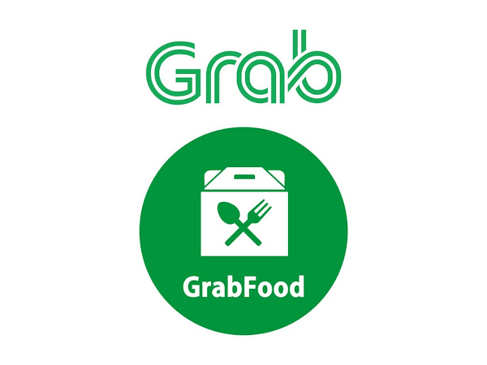

## Description

Grab is a biggest transportation company in Asia. Grab has many services such as GrabCar, GrabBike, Grab Delivery, GrabSubscription, and GrabFood. Some of their service are not available on some country. In Indonesia, GrabFood has more attention from customer because of its low prices than original price of the food. Grab always give promos for their customer

GrabFood as part of Grab is serve as an application based on Android and iOS devices. In GrabFood, the customer order foods in their application and a Grab driver will order the actual food in the actual restaurant and deliver it to the customer address.

As the one of the most used service in Indonesia with a good competitor in the same field, GrabFood has to deliver an amazing user interfaces and user experiences for keeping their customer to use their apps and services.

## Bad UI and UX

### Cannot change location from the checkout menu

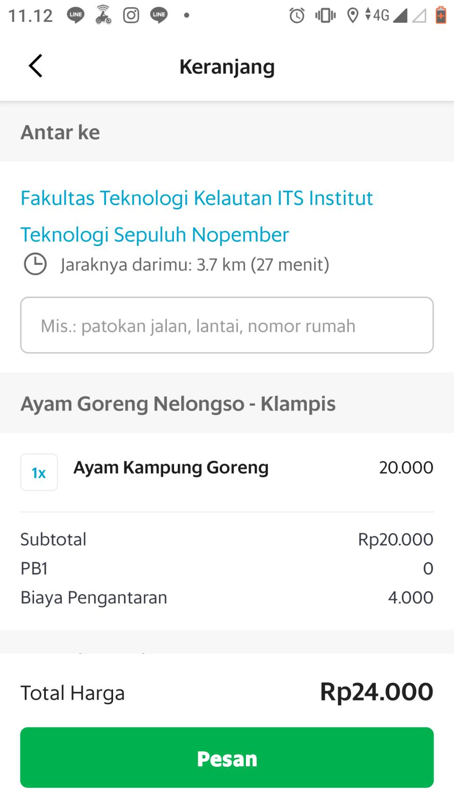

> We think that the bad UX is on the checkout page. If we want to change the drop off location, we must back to the main page of GrabFood and can't change directly from checkout page.

### The payment method and promo button are plain like its not a button

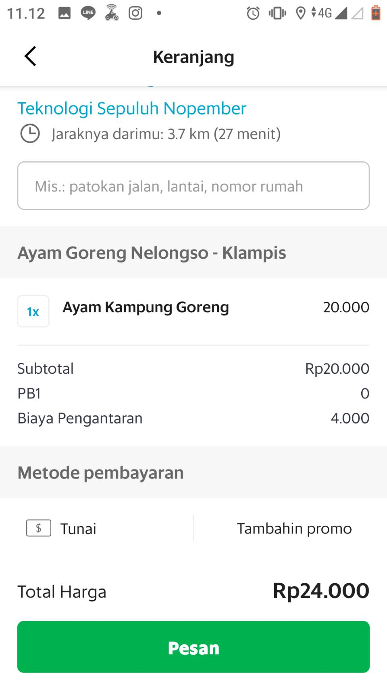

>From the picture we can see that the payment method section written Tunai(Cash). The payment method section in the picture is like an information served to the customer. But, the fact is that the payment method section is a button that can be clicked to change the payment method. Same case applied for promo section.

### Hard to figure how to change the quantity of a food.

>There is no information how to change the quantity of a food in the checkout menu. The information available is only the number of quantity already ordered by customer.

### Search bar doesnt have filter option.

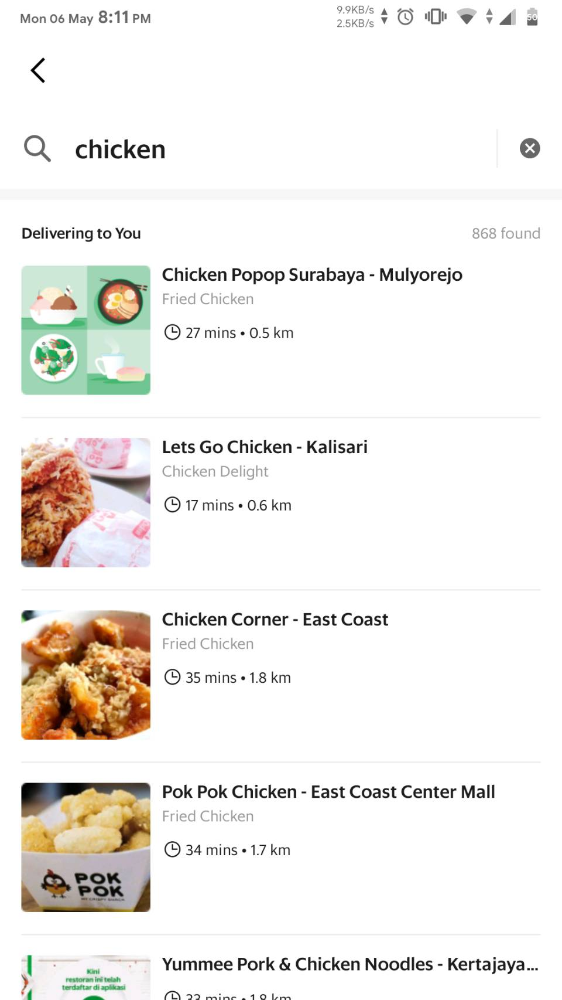

>GrabFood's search bar doesnt have filter to filter the search result. The customer cannot search food or restaurant based on the lowest price, nearest distance, the most rated, or the type of the food.

## Contextual Inquiry and Analysis

### Instruction Script

1. Find nearest fast food restaurant.
1. Order 2 food each with 2 quantity from that restaurant.
1. Go to checkout menu and change the delivery address to ITS.
1. Change the first food quantity to 3.
1. Remove the second food from checkout menu.
1. Change the payment method of the order.
1. Add promo to an order and the remove it.

### User Description

1. **Participant 1**:
    * The participant is male, 20 years old.
    * He is Informatics ITS 2017 student.
    * He never use Grab services.
    * He always use motorcycle as transportation.
    * He likes order food.

2. **Participant 2**:
    * The participant is male, 20 years old.
    * He is Geomatics Engineering ITS student.
    * He had experience using GrabFood service.
    * He always use motorcycle as transportation.
    * His main choice for ordering food is GrabFood.

3. **Participant 3**:
    * The participant is woman, 20 years old.
    * She is from Informatics Student.
    * She rarely use Grab service.
    * She had experience using another application for ordering food.

4. **Participant 4**:
    * The participant is male, 20 years old.
    * He is from Electrical Engineering Student.
    * He rarely use Grab service.
    * He always use motorcycle as transportation.
    * He rarely order food.
    
5. **Participant 5**:
    * The participant is male, 20 years old.
    * He is from Informatics Student.
    * He never use Grab Service.
    * He always use motorcycle as transportation.

### Transcript

#### **Participant 1**:

* **00:01** Me (Lix): Halo terimakasih sudah hadir untuk diwawancarai. Sebelumnya kamu tau Grab? Atau kamu sering menggunakan layanan dari Grab?
* **00:10** Participant : Emm.. saya sendiri jarang menggunakan Grab, aplikasinya jarang digunakkan juga.
* **00:20** Me: Kalau begitu, aku mau wawancarai servis dari Grab yaitu GrabFood. Coba kamu tekan pilih GrabFood menu.
* **00:39** Me: Nah, coba kamu explore tapi dimulai dari cari restaurant terdekat.
* **00:51** Participant: Restaurant terdekat yah.
* (Confuse with the menu.)
* **01:10** Participant: Kok bingung ya saya. Sebentar. Disini ada search ga sih?
* (Finding the search bar.)
* (Input the restaurant name from search bar.)
* **01:23** Me: Jadi kamu kalau mau cari restaurant terdekat, disearch ya?
* **01:29** Participant: Ya saya nyoba carinya di kolom search, biasanya muncul rekomendasi terdekat.
* (Found the restaurant.)
* **01:39** Participant: Ya kira-kira gini sih.
* (The result is not near the participant's location.)
* **01:41** Me: Kok jauh ya. Oh yaudah. Terimakasih. Coba kamu explore lagi. Tapi kamu diusahakan memesan dua makanan dari suatu restaurant. Manapun.
* **02:03** Participant: Dua makanan dari restaurant manapun.
* (Participant search the restaurant.)
* **02:23** Me: Kamu nyari apa?
* **02:24** Participant: Nyoba nyari restaurant dulu.
* **02:28** Me: Restaurant apa?
* **02:29** Participant: Disini saya nyari Ikan Bakar Keputih tapi belum ketemu, mungkin cari yang lain.
* (Search another restaurant.)
* **02:46** Participant: Ya saya nyari restaurant Laziza sepertinya. Yang deket didaerah Keputih. Terus pesan menu. Satu,... yak.
* **03:09** Me: Kalo bisa masing-masing menu dipilih dua.
* **03:19** Participant: Ini udah belum sih, kok cuma satu.
* (Confuse with order count.)
* **03:48** Participant: Dua paket takjil. Terus ditambah dua paket pizza kurma mini.
* **03:55** Me: Totalnya empat ya?
* **03:56** Participant: Iya empat item.
* **03:57** Me: Terimakasih, coba kamu ke checkout menunya.
* **04:03** Participant: Itu apa ya?
* **04:05** Me: Pembayaran. Coba kamu order ke ITS.
(Participant search the edit location menu.)
* **04:21** Me: Oh kamu udah ada di ITS. Coba edit ke Informatika aja deh.
(Participant can't find the edit location menu.)
* **04:34** Participant: Sebentar.
* (Confuse.)
* **04:44** Participant: Kok keliatannya gak bisa ya? Disini keliatannya karena pakai GPS. Tapi kok kena nya gedung PWK. Padahal sedang di Informatika.
* **04:58** Me: Kalau aku boleh kasi tau, kamu kalau mau gantinya tuh bukan disitu. Coba di back, back lagi, lagi. Nah.
* (Participant seems not understand with the feature.)
* **05:18** Participant: Ini ya? Oh berarti ditentuin dulu gitu ya pickup pointnya? Baru order.
* **05:25** Me: Apa lebih mudah?
* **05:27** Participant: Ya saya terbiasanya langsung ganti pas mau bayar. Jadi agak bingung kalo awal-awal harus milih tempat. Terus makanan saya hilang ga sih?
* (Back to order menu.)
* **05:47** Participant: Dimana makanan saya?
* **06:00** Me: Coba ganti lokasi dulu.
* (Edit the location.)
* **06:02** Participant: Kok gaada ya?
* **06:05** Me: Ketik aja kalau bisa.
* **06:20** Participant: Sudah, terus restaurant saya, pesanan saya dimana ya?
* **06:22** Me: Coba dicari lagi.
* **06:27** Participant: Oh ya ngulang lagi.
* (Participant repeating the order again.)
* **06:52** Me: Oke, coba kamu ganti pilihan itu jadi tiga, masing-masing.
* (Change the order.)
* **07:09** Me: Coba kamu kurangi atau batalkan makanan itu. Explore lagi.
* **07:22** Participant: Ngurangi tuh sampai nol sih.
* (Remove the order by decrease the counter.)
* **07:27** Participant: Ya dikurang-kurangi sampai nol.
* **07:36** Me: Oke, coba misalkan kamu masuk ke checkout menu lagi terus sekarang ganti pembayaran. Ganti metode pembayaran.
* **07:56** Participant: Mungkin bisa pakai OVO points.
* (Change payment method.)
* **08:03** Me: Udah bisa ya ganti metode pembayaran?
* **08:05** Participant: Ya sepertinya bisa. Cash bisa juga.
* **08:30** Me: Nah coba misalkan kamu mau ganti promo, gimana caranya?
* (Figuring out how to change the promo.)
* **08:50** Participant: Promonya sih ini, -4000 aja cuma ya keliatannya gak ada promo lain.
* **08:58** Me: Jadi kamu gatau gimana cara ganti promonya?
* **09:01** Participant: Gatau.
* **09:03** Me: Coba bisa explore lagi gimana.
* **09:05** Participant: Mungkin di awal balik lagi.
* (Participant back to home menu of GrabFood.)
* **09:15** Participant: Gak mungkin disini.
* (Participant still confuse.)
* **09:26** Participant: Ya keliatannya belum tau dimana tempat promonya.
* (Back to checkout menu and the order was reset again.)
* **10:02** Participant: Kayaknya gak bisa deh dari sananya.
* **10:06** Me: Jadi kalo boleh aku kasi tau, caranya tuh klik opsi ini. Menurut mu ini apa? Halaman ini jelas tidak informasinya?
* **10:31** Participant: Gak jelas sih dari awal GrabFoodByPartner tuh apa.
* **10:36** Me: Misalnya kamu mau hapus promo klik use later. Coba ganti promo lain.
(Searching add promo.)
* **11:29** Participant: Keliatannya gaada promo lagi deh.
* **11:31** Me: Oke, terimakasih. Gimana pengalaman kamu pakai GrabFood?
* **11:37** Participant: Sedikit canggung dan aneh, daripada yang saya pakai, aplikasi lainnya.
* **11:49** Me: Terimakasih ya sudah mau diwawancarai.
* **11:52** Participant: Ya sama-sama.

#### **Participant 2**:

1. **Me (Komang)** : Halo terima kasih sudah hadir diwawancarai. Sebelumnya apakah sudah tau aplikasi Grab ?
1. **Participant** : Ohh sudah tau.
1. **Me** : Pernah menggunakan layanan GrabFood ?
1. **Participant** : Pernah lumayan sering.
1. **Me** : Oke, jadi sekarang aku akan mewawancarai layanan GrabFood. Aku akan memberikan beberapa kegiatan untuk kau explore di aplikasi GrabFood.
1. **Participant** : Oke.
1. **Me** : Pertama - tama cari restoran fast food terdekat.
1. **Participant** : (Scrolling through menu)
1. **Participant** : (Found a restaurant but not the nearest) ini dia. Bener ga ?
1. **Me** : Gimana caranya tau dia terdekat ?
1. **Participant** : Jaraknya cuma 0,7 km jadi terdekat lah.
1. **Me** : Caranya kau nyari gimana ?
1. **Participant** : Scroll di halaman utama aja cari kira2 yang paling deket.
1. **Me** : Yakin itu yang paling deket ?
1. **Participant** : Hmmm.
1. (Participant trying to find the nearest again).
1. **Participant** : Ohh ini MC Donald jaraknya cuma 0.5km.
1. **Me** : Salah berarti tadi ya.
1. **Participant** : Iya.
1. **Me** : Lanjut ya. Order 2 jenis makanan dengan masing - masing makanan jumlahnya 2. Bebas.
1. **Participant** : (Ordering Food)
1. **Participant** : Udah.
1. **Me** : Masuk ke menu pembayaran.
1. **Participant** : Udah.
1. **Me** : Ganti alamat pengiriman menuju ITS.
1. **Participant** : (Clicks add note to driver).
1. (Participant Confuse)
1. (Participant repeatedly clicking the address information)
1. **Participant** : Gabisa diganti ya ini.
1. **Me** : Bisa kok, coba cari cara lain.
1. **Participant** : Hmm.
1. (Participant Confuse)
1. (Participant back to the home page of Grab)
1. **Participant** : Bingung aku wkwk.
1. (Participant trying to order again)
1. **Participant** : Oalah ini ya ? kampret.
1. **Me** : Gimana ?
1. **Participant** : Baru tau kalo gantinya harus dari luar, ribet.
1. **Me** : Coba ulangi sampai nyampe menu pembayaran.
1. **Participant** : Udah.
1. **Me** : Sekarang coba ganti makanan pertama jumlahnya jadi 3.
1. **Participant** : (Found the button to change quantity).
1. **Participant** : Udah.
1. **Me** : Okee. Coba hapus makanan kedua dari order.
1. **Participant** : (Found the way to change the quantity).
1. **Participant** : Udah.
1. **Me** : Gampang ya.
1. **Participant** : Iya klo itu gampang.
1. **Me** : Coba ganti metode pembayarannya. Jadi OVO points misalnya.
1. **Participant** : (Click the payment method section).
1. **Participant** : Udah.
1. **Me** : Gampang lah ya.
1. **Me** : Coba tambah promo untuk ordernya.
1. **Participant** : Promo oke.
1. **Participant** : (Click the promo section).
1. **Participant** : Udah.
1. **Me** : Okee. Coba batalkan promo.
1. **Participant** : (Click the promo section and click use later).
1. **Participant** : Udah.
1. **Me** : Okee jadi gimana pendapatnya ?
1. **Participant** : Iya kalo menurutku karena sering make jadi mungkin udah terbiasa tapi tetep aja tadi gabisa nyari cara ganti lokasi wkwkw.
1. **Me** : Jadi masih ada kesusahan ya.
1. **Participant** : Iya.
1. **Me** : Okee terima kasih.

Participant 3:

* **00:01** Me: Halo, terimakasih sudah mau diwawancarain,jadi aku mau nanya-nanya dari fitur/layanan dari Grab, GrabFood. Mungkin kamu bisa buka menunya langsung.
* **00:18** Participant: Menu? Oh itu dia.
* **00:23** Me: Oh ya sebelumnya kamu sering menggunakan GrabFood atau layanan Grab tidak?
* **00:27** Participant: Emm.. jarang sih
* **00:32** Me: Oh oke, mungkin kamu bisa explore terlebih dahulu, tapi dimulai dari kamu milih restaurant terdekat.
* (Participant searching nearest restaurant.)
* **01:03** Participant: Kamu coba cari restaurant paling deket dari kamu tuh dimana.
* **01:07** Participant: Ini deh.
* **01:10** Me: Oh oke, coba deh kamu order dua makanan, masing-masing banyaknya dua.
* (Participant selecting the food.)
* **01:26** Participant: Oke. Dua buah.
* **01:35** Me: Kalau udah coba kamu ke halaman checkout, pembayaran.
* (Participant go to checkout menu.)
* **01:51** Me: Nah, di halaman checkout itu, kamu ganti halamannya ke Informatika.
* (Participant trying to change location from checkout menu.)
* **02:04** Participant: Sebentar ya. Emang bisa langsung ya?
* **02:08** Me: Emang gimana caranya?
* **02:10** Participant: Balik dulu gak sih?
* (Back to front page of GrabFood.)
* (Changing the location.)
* **02:30** Participant: Terus mesen lagi dong?
* **02:31** Me: Menurutmu, pesanannya ilang ga?
* **02:33** Participant: Iya.. Iya ilang. Tuh ilang.
* **02:44** Me: Oke, coba ganti jumlahnya jadi tiga.
* **02:54** Participant: Oke, terus?
* **02:55** Me: Kalo udah coba pesanan yang kedua itu tiga juga. Yang pertama itu kurang dua. Caranya gimana?
* **03:16** Participant: Ini, tinggal di klik lagi trus jadi dua.
* **03:22** Me: Coba pesanannya dibatalin gitu gimana?
* (Decrease the counter until zero.)
* **03:37** Me: Coba kamu checkout lagi. Kalo ganti metode pembayaran gimana?
* **03:54** Participant: Emm.. ini?
* **04:03** Me: Oke oke, terus klik apa?
* (Participant change the method payment.)
* **04:09** Me: Kalo ganti promo?
* (Participant add promo by accidentally clicking the promo button.)
* **04:28** Me: Oke, terimakasih.
* **04:33** Participant: Oke, sama-sama.

#### **Participant 4**:

1. Me (Syauqi): Terima kasih sudah hadir untuk diwawancarai. Sebelumnya sudah tahu aplikasi Grab?
1. Participant: Sudah tahu.
1. Me: Sudah pernah menggunakan layanan GrabFood?
1. Partcipant: Sudah pernah.
1. Me: Sering apa jarang?
1. Participant: Jarang sih, tapi lebih dari sekali.
1. Me: Ini saya ingin wawancara lebih ke GrabFoodnya sih. Nanti saya akan ngasih beberapa tugas untuk mengexplore aplikasi GrabFood. Yang pertama, coba nyari restoran terdekat.
1. Participant: (Scrolling the page) Sebenarnya ini udah ketahuan sih, dari ini terdekat. Jaraknya 0.6, 0.8 kan itu yang terdekat.
1. Me: Yakin?
1. Participant: Iya. Ini jaraknya 0.6, 0.8, 0.9 sudah urut. Nih 3.8, 4.0.
1. Me: Coba lebih scroll ke bawah.
1. Participant: (Scrolling the page) Oh iya, jaraknya kurang lagi. Tapi tetap yang paling deket 0.6 di atas tadi sih. Ada gak fitur buat urutinnya? Gak ada ya?
1. Me: Coba buka pilihan fast food. Dan cari restoran terdekat.
1. Participant: Ini paling atas 2 kilo. (Scrolling the page) Oh ini ada yang 1.2 kilo. 1.3 ini.
1. Me: Yang paling atas tadi berapa? 2 kilo ya?
1. Participant: Iya. Ini yang kutemuin paling deket 2 kilo. Kurang ada fitur search nih.
1. Me: Nah terus coba pesen 2 makanan dengan masing-masing pesen 2. Bebas.
1. Participant: Oke. Ini kutambahkan ke keranjang. Ini kutambahin 2 lagi ke keranjang. Udah.
1. Me: Oke, coba langsung ke menu pembayaran.
1. Participant: Hm. (Go to the checkout page).
1. Me: Oke terus coba ganti alamat pengiriman.
1. Participant: Ganti alamat pengiriman. (Press the address text repeatedly). Gak bisa. Bisa keluar dari halaman ini kan? Bebas kan?
1. Me: Iya.
1. Participant: Kalau ganti alamat pengirimannya tuh disini. (Back to the home of GrabFood). Ini udah.
1. Me: Oke. Terus coba ulangi yang tadi sampai ke menu pembayaran yang tadi.
1. Participant: Oke, ini kita coba pesen KFC, 2, ini 2.
1. Me: Coba hapus makanan kedua dari order.
1. Participant: Ini hapus. Oke udah.
1. Me: Coba ganti metode pembayarannya, misalnya ovo.
1. Participant: Ini. Udah.
1. Me: Coba tambahkan promo untuk ordernya.
1. Participant: Udah.
1. Me: Coba hapus promonya.
1. Participant: Udah.
1. Me: Gimana nih pengalamannya?
1. Participant: Ini udah simpel, mudah digunakan. Cuma kekurangannya di masalah filter tadi. Misalnya di fast food ini ada filter dari harga terendah atau jarak terdekat. Meskipun di sini ada keterangan jaraknya tapi gak ada fitur urutkan. Kurangnya itu sih.
1. Me: Sepertinya itu saja, terima kasih sudah ingin diwawancarai.
1. Participant: Ashiaap.

#### **Participant 5**:
1. Me (Syauqi): Terima kasih sudah hadir untuk diwawancarai. Sebelumnya sudah tahu aplikasi Grab?
1. Participant: Tahu.
1. Me: Apa kamu sering menggunakan layanan dari Grab?
1. Participant: Gak pernah sih.
1. Me: Gak pernah? Serius?
1. Participant: Iya.
1. Me: Oke. Yang mau saya ingin wawancara di sini adalah tentang GrabFood. Coba kamu cari restoran yang terdekat.
1. Participant: (Point at the smartphone with confused face)
1. Me: Silahkan bereksplorasi sendiri pak.
1. Participant: (Use sign language, with confused face)
1. Me: Ngomong, Pak, biar saya tidak bingung nulisnya nanti.
1. Participant: Ini gimana saya nyari restoran terdekatnya?
1. Me: Dieksplor aja, Pak.
1. Participant: Ini, Lazizaa keputih?
1. Me: Ada yang lebih dekat gak?
1. Participant: Pecel Madiun Pak Jito Kalisari?
1. Me: Emang itu paling deket, Pak?
1. Participant: 19 menit sih.
1. Me: Jaraknya, Pak.
1. Participant: 1.2 kilo.
1. Me: Ada yang lebih deket gak?
1. Participant: Ini sih, Lazizaa keputih 0.6 kilometer.
1. Me: Coba cari ada yang lebih deket lagi gak dari itu?
1. Participant: Gak ada anj*r, ini yang bawah udah jauh-jauh. Saya gak nemu ya.
1. Me: Nah coba di scroll dulu.
1. Participant: Ini makin ke bawah makin jauh.
1. Me: Ayo kita lihat.
1. Participant: (Scrolling the page).
1. Me: Nah ini balik lagi ke 1 kilometer. Berarti gak ada yang lebih deket lagi dari Lazizaa ya, Pak.
1. Participant: Iya.
1. Me: Ya udah kita lanjut aja. Coba pilih satu restoran, bebas.
1. Participant: Swiwings Mulyosari.
1. Me: Terus coba order makanan masing-masing 2.
1. Participant: (Order the food)
1. Me: Coba langsung di check out.
1. Participant: (Checkout the order)
1. Me: Coba ganti alamat pengiriman.
1. Participant: (Press the address text repeatedly)
1. Me: Gak bisa? Bapak ngomong, Pak, jangan membisu wkwk
1. Participant: Ini kayaknya gak bisa deh diganti.
1. Me: Jadi gantinya itu harus kembali ke awal. Terus tekan ini.
1. Participant: Oh gitu.
1. Me: Terus coba kembali ke tadi, pesen lagi kayak tadi.
1. Participant: Ini pesanannya ke reset ya?
1. Me: Iya.
1. Participant: Saya pesen di Medanwei di Kalisari. Mahal-mahal ya. Saya pesen 2 ya?
1. Me: Iya. Coba ganti jumlah pesanan yang pertama jadi 3.
1. Participant: Bisa bisa.
1. Me: Terus coba hapus makanan yang kedua.
1. Participant: Udah.
1. Me: Coba ganti payment method nya.
1. Participant: Udah bisa.
1. Me: Coba tambahkan promonya.
1. Participant: Udah.
1. Me: Terus coba hapus.
1. Participant: Udah.
1. Me: Oke, sudah terima kasih. Tolong jangan dipesan makanannnya, Pak. nanti saya yang bayar.
1. Participant: Hahaha.

---

### Models and Annotations

### Artifact Model

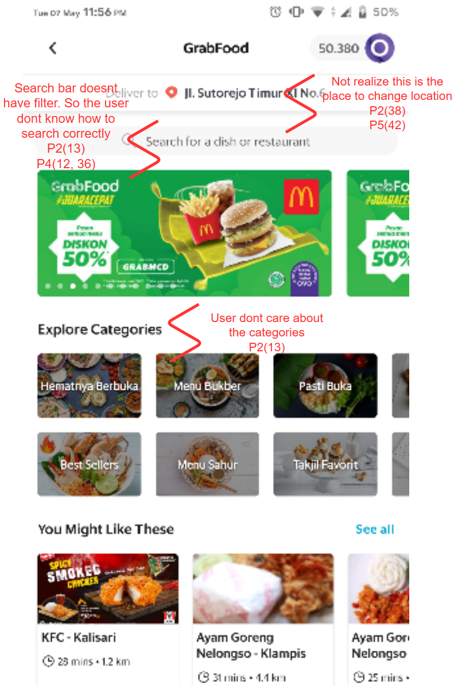

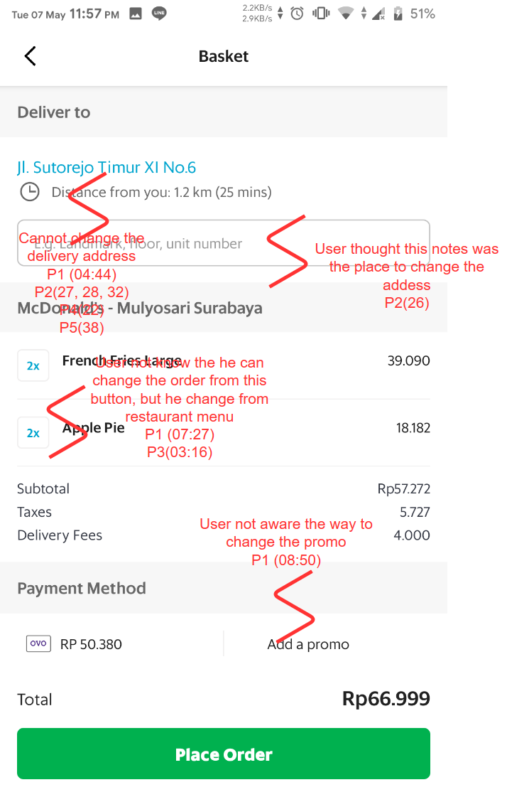

### Flow Model

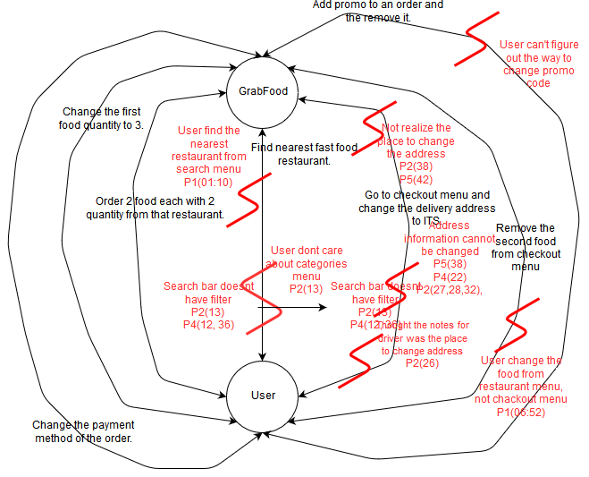

### Cultural Model

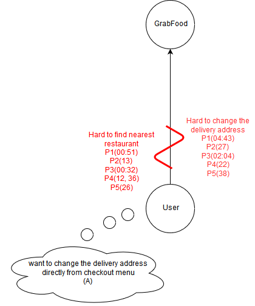

## Sketching and Prototyping

---

### Part A: Sketches

### 1. Scan/Photo of Sketches

#### First Design

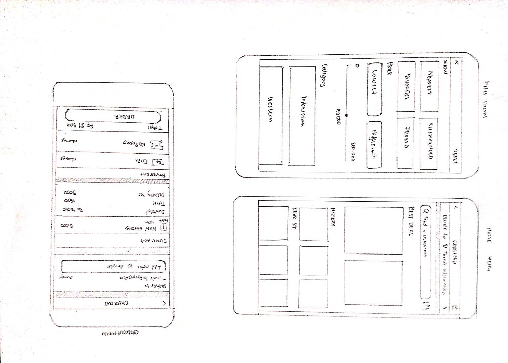

#### Second Design

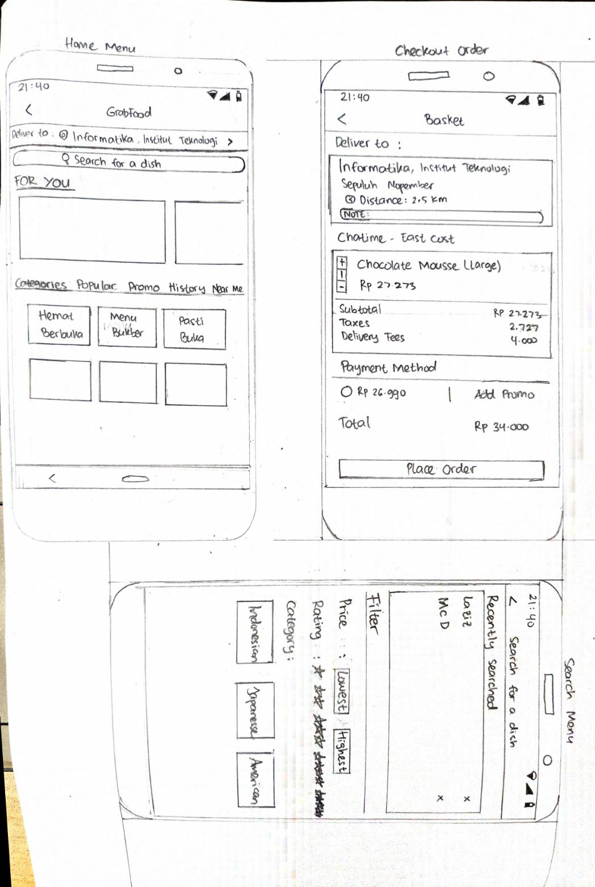

#### Third Design

### 2. Version Differences

#### First Design

The first design mainly about simplicity yet meaningfull and easy to understand for the user. Simplicity reflected by cards in most layout.

#### Second Design

The second design is the alternative to the first design, such as search bar menu is more advance. The filter from first design included on search bar, so it does give more compact layout.

#### Third Design

### 3. Selected Sketch

## Prototypes

### Free Hand

### Prototype

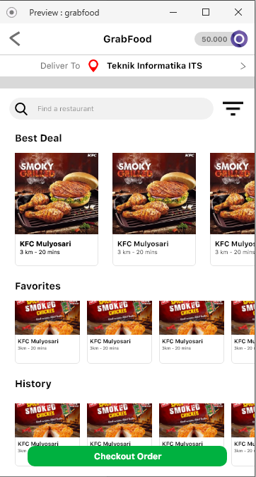

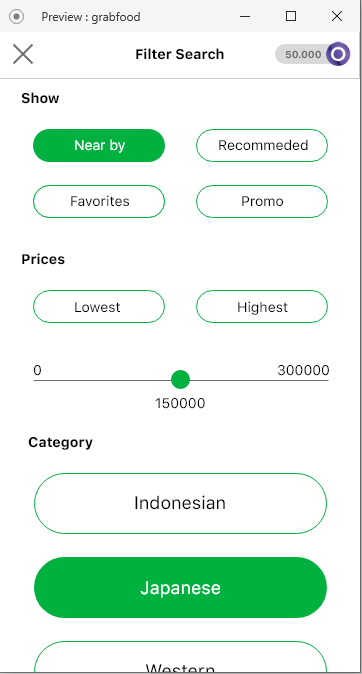

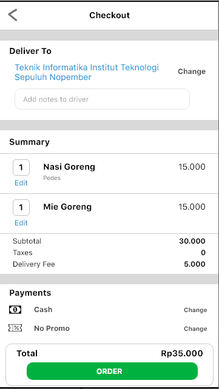

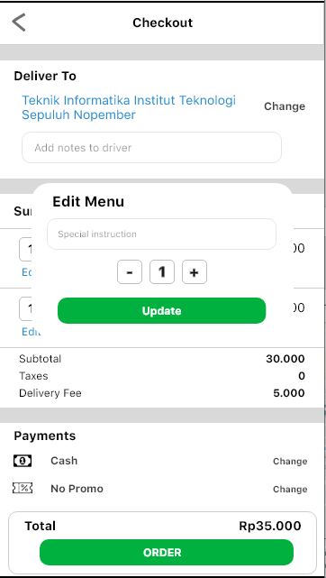

### High Fidelity Version  

[Adobe XD High Fidelity](https://xd.adobe.com/view/1d424ac5-d55e-4429-61ff-dedd0ae6a7af-6b73/?fullscreen)

